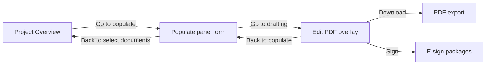

# Draft.clio.com vs PDFTimeSaver — UI Deep Dive (All Pages)

**Date:** June 18–19, 2026 (completion pass June 19)  
**Method:** Live Browser MCP audit of signed-in `draft.clio.com` (YOUNGMAN REITSHTEIN, PLC) + source review of all `mvp/views/*.php` routes.  
**Status:** Complete — see §19 audit matrix  
**Companion docs:** `DRAFT_CLIO_VS_PDFTIMESAVER_COMPARISON.md` (feature/workflow parity) · `UI_STYLES_REFERENCE.md` (our CSS) · `ui-components-reference.md` (Clio component inventory)

**Contents (§1–10):** shells, tokens, page map, page-by-page UI, our-only pages, components, typography, interactions, alignment matrix, audited URLs.  
**Expanded (§11–17):** Clio design system, navigation catalog, autopopulate chain, functionality catalog, workflow split, style crosswalk, list patterns.

---

## 1. How Clio organizes UI (three shells)

Clio Draft is not one layout — it switches shells by context:

| Shell | When used | Left nav | Top chrome | Content pattern |
|-------|-----------|----------|------------|-----------------|
| **A — App list** | Clients, Projects, client tabs, settings | **Dark sidebar** (Clients, Projects; Help, Team, firm) | Page **H1** + user **avatar circle** (initials) top-right | Toolbar row → scrollable **card list** |
| **B — Settings** | Team, Form libraries, Integrations, Account | Dark sidebar **+ secondary Settings nav** (Account, Subscription, Integrations, Form libraries) | Same H1 + avatar | Form sections + Save |
| **C — Workflow** | `/panels/populate/`, `/panels/edit/` | **Sidebar hidden** | **Full-width banner**: logo, client › project links, Client vault, avatar | Stage actions + main workspace |

**PDFTimeSaver** uses **one shell everywhere**: light `#f8f9fa` **200px sidebar** (Dashboard, Clients, Projects, Settings, admin tools) + white content card stack. Workflow pages (populate, drafting) **keep the same sidebar** — major UX difference from Clio workflow mode.

---

## 2. Global design tokens

| Token | Clio Draft (live) | PDFTimeSaver |
|-------|-------------------|--------------|
| **Primary nav** | Dark charcoal sidebar, white active text + left bar | Light gray sidebar, blue `#007bff` active |
| **Page title** | Single **H1** per view (“Clients”, “Projects”) | **H2 ~24px** inside `.pdftimesaver-card` (“All Matters”, “Project View”) |
| **User menu** | Avatar circle top-right (e.g. **MK**) | No global user avatar |
| **Primary button** | Solid blue, ~36–40px, label “Add new client” | `.pdftimesaver-btn` / `.pdftimesaver-btn-action` (42px on fill footer) |
| **Secondary** | Text links, dropdown chevrons | `.pdftimesaver-btn-secondary` gray outline |
| **List pattern** | **Bordered cards**, person icon, metadata line | **`pdftimesaver-table`** rows |
| **Status control** | **Inline `<select>`** on every list row | Badge in table column; dropdowns on drafting header |
| **Tabs** | Underline tabs with **counts** `Active (460)` | Segmented pills or separate links |
| **Search** | Icon inside field, placeholder “Search clients/projects/users” | Magnifier in field or separate search button |
| **Empty states** | H3 + short copy (“No Notes”, “No client files”) | Emoji + headline + helper link |
| **Help** | Intercom chat bubble (bottom-right) on all pages | Minimal `support.php` |
| **Font** | Clean sans (product UI) | System stack `-apple-system, Segoe UI…` 14px base |

---

## 3. Page map — Clio URL ↔ our route

| Clio page | Our closest route | Parity |
|-----------|-------------------|--------|
| `/clients/active/` | `?route=clients` | Medium |
| `/clients/archived/` | `?route=clients&status=archived` | Medium |
| `/clients/create/` | Inline form on `clients` + `actions/create-client` | Medium |
| `/clients/info/projects/` | `?route=client&id=` (matters list) | Low |
| `/clients/info/profile/` | `?route=client&id=` (profile sections) | Medium |
| `/clients/info/vault/` | `drafting.php` client vault panel only | Low |
| `/clients/info/notes/` | — | **Missing** |
| `/clients/projects/` | `?route=projects` | Medium |
| `/clients/project/info/` | `?route=project&id=` | Low–medium |
| `/clients/project/edit/` | Partially `project` (name only) | Low |
| `/clients/project/signatures/` | — | **Missing** |
| `/panels/populate/` | `?route=populate&pd=` | Different UX |
| `/panels/edit/` | `?route=drafting&pd=` | Medium |
| `/clients/support/` | `?route=support` (if routed) | Low |
| `/clients/settings/subscription/licenses/` | — | **Missing** |
| `/clients/settings/form-libraries/` | `form-sets-manager` + imports | Different |
| `/clients/settings/integrations/` | — | **Missing** |
| — | `?route=dashboard` | **Ours only** |
| — | `form-management`, `universal_processor` | **Ours only** |
| — | `field-manager`, `firm-defaults` | **Ours only** |

---

## 4. Page-by-page UI comparison

### 4.1 Dashboard

| | Clio | PDFTimeSaver |
|---|------|--------------|
| **Exists?** | **No** — lands on Clients | `?route=dashboard` |
| **Layout** | — | Stat chips (Matters, Clients, Documents) + Recent Documents table |
| **UI gap** | Clio skips dashboard entirely | We expose an extra hop; consider default route → Clients to match Clio |

---

### 4.2 Clients list — Active / Archived

**Clio** `/clients/active/` · `/clients/archived/`

| UI element | Clio | PDFTimeSaver `clients.php` |
|------------|------|----------------------------|
| Title | H1 “Clients” | Card H2 (implicit via toolbar) |
| Status filter | Tabs: **Active (460)** \| **Archived (176)** with underline | Segmented control same pattern ✓ |
| Search | “Search clients” + icon | “Search clients…” with 🔍 in field |
| Sort | “Sort by ▾” link (modal/menu) | `sort` query param in URL |
| Primary CTA | **Add new client** (top-right blue) | Add Client scrolls to inline form (not separate page) |
| Row layout | **Card** with icon, name, `N Projects, last modified` | **Table**: name link, email, project count, status, actions |
| Row actions | **Active/Archived dropdown** + ⋮ menu | Archive / Delete in Actions column |
| Per-row status | Change archive without leaving list | Must use client detail or actions |
| Avatar | Top-right **MK** | None |

**UI recommendations:** Optional card view toggle; per-row archive dropdown; move “Add client” to dedicated page or modal like Clio.

---

### 4.3 Add client

**Clio** `/clients/create/`

| UI element | Clio | PDFTimeSaver |
|------------|------|--------------|
| Title | H1 “Add new client” | H3 “Add New Client” inside list page card |
| Person/Company | **Radio toggle** at top | Not present (display name only) |
| Fields | First, Middle, Last*, Phone, Email, DOB, address block | Display name, email, phone, company, address |
| Submit | **Add client** (disabled until valid) | Create Client on same page |
| Navigation | List shell | Embedded below clients table |

**Gap:** Clio splits Person vs Company and uses legal name fields; we use a simplified profile model + Field Manager for extensions.

---

### 4.4 Client detail hub

**Clio** uses **horizontal sub-tabs** under client H1:

`Projects (N)` | `Client vault` | `Profile` | `Notes (N)`

**PDFTimeSaver** `client.php` — **single long page**:

- Profile blocks (dynamic labels from Field Manager)
- Custom fields section
- Linked matters table
- Archive/delete actions
- No tab strip; vault not on client page

| Sub-area | Clio tab | Our equivalent |
|----------|----------|----------------|
| Matters | Projects tab | Matters list on same page |
| Files | Client vault tab | Only in drafting sidebar |
| Profile | Profile tab | Top of `client.php` |
| Notes | Notes tab | **None** |

---

### 4.5 Client profile

**Clio** `/clients/info/profile/`

- Person/Company radio
- First / Middle / Last name fields
- Phone, Email, DOB, Street, Zip, City, State
- **User Access:** “14 of 14 users… Manage user access”
- **Save** button (explicit save — not autosave)

**PDFTimeSaver** `client.php`

- Dynamic field labels via Field Manager
- Autosave on profile fields (AJAX)
- No user-access / permissions UI
- Extra: company, custom fields grid

---

### 4.6 Client vault

**Clio** `/clients/info/vault/`

- Empty: “No client files” + drag/Browse
- List shell + client tabs

**PDFTimeSaver**

- Vault UI only on **`drafting.php`** right panel (drag zone + file list)
- Not reachable from client detail

---

### 4.7 Client notes

**Clio** `/clients/info/notes/`

- “Add new note” affordance
- Empty: H3 “No Notes”

**PDFTimeSaver:** **No notes feature**

---

### 4.8 Global projects list

**Clio** `/clients/projects/`

| UI element | Clio | PDFTimeSaver `projects.php` |
|------------|------|----------------------------|
| Title | H1 “Projects” | H2 “All Matters” |
| Filters | **All (4871)** \| **In progress (3520)** \| **Review (32)** \| **Completed (1319)** | Status column only; no top filter tabs |
| Search | “Search projects” | “Search for project” + magnifier button |
| Sort | Sort by ▾ | Browse mode toggle |
| Row | Project name + **Client: X** + modified date | Matter, Client, Status, Last Modified |
| Row status | Inline In progress / Review / Completed | Text badge; list Complete hidden |
| CTA | (create from client context) | **New Project** + **Browse** |

**Gap:** Clio’s status filter tabs with live counts are a major list UX feature we lack.

---

### 4.9 Client-scoped projects

**Clio** `/clients/info/projects/`

- Same card list as global but filtered to client
- **Add new project** button
- Per-project status dropdown

**PDFTimeSaver:** Matters listed on `client.php` — table with links to Project View, not card list.

---

### 4.10 Project overview

**Clio** `/clients/project/info/`

| Section | Clio UI | PDFTimeSaver `project.php` |
|---------|---------|----------------------------|
| Header | Client link › **Project title** (two H1s) | “Project View” title card |
| Tabs | **Overview** \| **Signed documents** | None — wizard sections |
| Actions | **Duplicate**, Edit (in Summary) | Delete project (trash icon) |
| Summary | Status dropdown, project name, **Responsible attorney** | Client picker, Case picker, Form set picker (separate cards) |
| Documents | **+ Add/remove documents** — icon list | Form table with order, status, Fill Out |
| Primary CTA | **Go to populate →** | **Next** / per-form Fill Out |

**Layout difference:** Clio = **one overview screen**. Ours = **multi-card wizard** (name → client → case → form set → forms table).

---

### 4.11 Project edit (metadata)

**Clio** `/clients/project/edit/`

- Back to Overview link
- Project Name* text field
- **Responsible Attorney** autocomplete (“Select attorney”) + helper text about autopopulate
- **Save** + **Go to populate →**

**PDFTimeSaver:** Project name inline on Project View; **no responsible attorney**; attorney data from firm defaults / populate.

---

### 4.12 Signed documents

**Clio** `/clients/project/signatures/`

- Lists packages with recipients, sent date, **Closed** status
- Help text: use Sign in drafting for new sends
- **Go to populate →** at bottom

**PDFTimeSaver:** **No equivalent tab or page**

---

### 4.13 Populate (fill stage)

**Clio** `/panels/populate/` — **Workflow shell C**

| UI element | Clio | PDFTimeSaver `populate.php` |
|------------|------|----------------------------|
| Sidebar | **Hidden** | **Visible** (full app nav) |
| Header | Client › Project + **Client vault** link | Document title card; Back to Matter |
| Stage nav | ← **Back to select documents** \| **Go to drafting →** | Workflow chips: Populate → Drafting → Download |
| Field UI | **Vertical labeled form**; “×N Repeated N times” | **PDF page canvas** + overlay inputs OR panel fallback |
| Court | **Select court** button | Case/court text fields |
| Field props | No sidebar | **Field properties** panel (font +/-) |
| Multi-form | Single scroll form | Form dropdown, Single/All Forms mode |
| Footer | (stage links only) | **Scope + Export + Next + Complete + Finish** (42px bar) |
| Project forms table | Not on populate | Ordered forms table above workflow |
| Save | Implicit | **Save Form** + autosave |

**Critical UI divergence:** Clio populate looks like a **web form**. Ours looks like a **document editor** at the same workflow stage.

---

### 4.14 Draft / edit

**Clio** `/panels/edit/` — **Workflow shell C**

| Zone | Clio | PDFTimeSaver `drafting.php` |
|------|------|----------------------------|
| Left | **Insert** + Add custom field | ← Back to populate, Insert |
| Center | **PDF scan + positioned inputs** | iframe PDF + custom field overlay |
| Right | **Documents (7)** + Add/Remove | Document list panel + **Client vault** |
| Header actions | Back to populate, **Sign**, **Download**, status ▾ | Same pattern; **Sign disabled** |
| Breadcrumb | In banner (client › project) | Text breadcrumb in header center |

Clio puts **visual PDF editing here**; we split visual fill between populate (native fields) and drafting (generated PDF + custom fields).

---

### 4.15 Support

**Clio** `/clients/support/`

- H1 Support
- Sections: Help Center link, Email, Chat, Phone (toll-free + local)
- Intercom integration

**PDFTimeSaver** `support.php`

- Minimal heading + mailto + SVG placeholder image
- Not in main sidebar nav (Clio: sidebar footer item)

---

### 4.16 Team / subscription

**Clio** `/clients/settings/subscription/licenses/`

- Settings sub-nav + Team tab row (Team, Plan, Billing, Payment)
- Search users, **Add seats**
- User cards: name, email, “has access to All clients”

**PDFTimeSaver:** **No team/licensing UI**

---

### 4.17 Form libraries (settings)

**Clio** `/clients/settings/form-libraries/`

- Checkboxes: **California Judicial Council and County forms**, **USCIS Forms**
- Save — toggles vendor template libraries

**PDFTimeSaver:**

- `form-sets-manager` — custom bundles of imported templates
- `form-management` / universal processor — upload & map individual PDFs
- **Different paradigm:** we own templates; Clio licenses pre-built libraries

---

### 4.18 Integrations

**Clio** `/clients/settings/integrations/`

- **Clio** integration card + Connect button (import contacts)

**PDFTimeSaver:** **None**

---

### 4.19 Settings hub

**Clio:** Settings accessed via sidebar **Team** → nested settings nav

**PDFTimeSaver** `settings.php`

- Card grid: Font Settings, Forms, “More Settings coming soon”
- Admin tools also duplicated in **main sidebar** (Forms Manager, Form Sets, Field Manager, Firm Information)

**UI issue:** Our admin surface is **noisier** — Clio hides template/config complexity in Settings; we expose it in primary nav.

---

## 5. PDFTimeSaver-only pages (no Clio Draft equivalent)

These pages have **no mapped Clio screen** in the attorney workflow. UI should **not** mimic Clio here — but nav prominence should be role-gated.

| Route | View | UI character |
|-------|------|--------------|
| `dashboard` | `dashboard.php` | Stats + recent docs table |
| `form-management` | `universal_processor.php` (mode) | Wizard steps, upload, preview grid + **320px field sidebar** |
| `universal-processor` | same | Robot hero, diagnostics panel |
| `form-sets-manager` | `form_sets_manager.php` | Toolbar + editable table, icon buttons 30px |
| `field-manager` | `field_manager.php` | Pill tabs Firm/Client/Case + CRUD table |
| `firm-defaults` | `firm_defaults.php` | Read-only-ish defaults table + inline edit |
| `font-settings` | `font-settings.php` | Nested under Settings |
| `documents` | `documents.php` | Global documents table |
| `forms` | forms list | Generated form records |
| `client-mapping` | `client_mapping.php` | Mapping admin |
| `alias-manager` | `alias_manager.php` | Alias admin |
| `activities`, `bills`, `reports` | legacy stubs | Minimal / placeholder |
| `automated_verification`, `diagnostics`, `debug_*` | dev/QA | Internal tools |

**Clio closest analog:** Form libraries + firm/user settings + hidden vendor form admin — all under **Settings**, not main nav.

---

## 6. Shared components — side-by-side

### 6.1 List rows

```
CLIO CARD ROW                          OUR TABLE ROW
┌─────────────────────────────────┐   ┌──────────┬─────────┬────────┬─────────┐
│ 👤  Client Name                 │   │ Matter   │ Client  │ Status │ Actions │
│     12 Projects, modified 04/27 │   ├──────────┼─────────┼────────┼─────────┤
│                    [Active ▾] ⋮ │   │ Link…    │ Name    │ Badge  │ View    │
└─────────────────────────────────┘   └──────────┴─────────┴────────┴─────────┘
```

### 6.2 Workflow header

```
CLIO (populate/edit)                   OUR POPULATE
┌──────────────────────────────────┐  ┌──────── sidebar ────────┐
│ Logo  Client › Project  Vault  MK│  │ Dashboard              │
├──────────────────────────────────┤  │ Clients …              │
│ ← Back …     Go to drafting →    │  ├────────────────────────┤
│ [ form fields or PDF editor ]    │  │ Document: FL-100 …     │
└──────────────────────────────────┘  │ [ PDF preview + panel ] │
                                      │ [ Export | Next | … ]   │
                                      └─────────────────────────┘
```

### 6.3 Status dropdown values

Both use **In progress | Review | Completed** — Clio places dropdown on list rows, project summary, and drafting header; we use badges + drafting header + Fill Out Complete action.

### 6.4 Right panels

| Panel | Clio | PDFTimeSaver |
|-------|------|--------------|
| Field properties (import) | `form-manager-sidebar` 320px on processor | Same on `universal_processor.php` ✓ |
| Field properties (fill) | None on populate | **300px `fillout-sidebar`** on populate ✓ |
| Document list | Edit stage right column | Drafting left column |
| Client vault | Edit header link + client tab | Drafting right column |

---

## 7. Typography & spacing patterns

| Pattern | Clio | PDFTimeSaver |
|---------|------|--------------|
| Page title size | ~28–32px H1, one per view | 24px H2 in card header |
| Section title | H2 (“Summary”, “Documents”) | `wpts-form-title`, strong tags |
| Helper text | Short gray under headings | `wpts-form-help`, `#64748b` 13px |
| Card padding | ~24px white on gray `#f5f5f5` bg | `.pdftimesaver-card` white on `#f5f6fa` |
| Table header | N/A (uses cards) | `#f8f9fa` thead, 13–14px |
| Iconography | Line icons in nav | Emoji in admin nav (🗂️ 📚 🧩 🏢) |
| Workflow steps | Text links in banner | `.workflow-progress` pills (Populate active) |

---

## 8. Interaction patterns

| Interaction | Clio | PDFTimeSaver |
|-------------|------|--------------|
| Save profile | Explicit **Save** button | Autosave (client, project config, populate) |
| Open matter | Click card row (implicit) | Click matter link in table |
| Change status | Dropdown on row | Drafting header / Complete on fill |
| Add documents | + Add/remove on overview | Form set + additional forms in wizard |
| Export PDF | Download on edit header | Export on populate footer + Download on draft |
| Sign | Sign on edit header | Disabled button |
| Search | Instant filter in list | Form GET submit / JS search on clients |
| Sort | “Sort by” popup | URL query params |

---

## 9. Priority UI alignment matrix (by page)

| Page | Align to Clio? | Suggested change |
|------|----------------|------------------|
| Clients | **Yes** | Card list option; row archive dropdown; dedicated create page |
| Projects | **Yes** | Status filter tabs with counts |
| Project View | **Partial** | Add Overview tab layout; surface documents like Clio; **Go to populate** CTA label |
| Populate | **Partial** | Optional panel-only mode; hide sidebar in workflow; Client vault in header |
| Drafting | **Yes** | Enable Sign; match 3-column proportions |
| Client detail | **Yes** | Tab strip: Projects / Vault / Profile / Notes |
| Dashboard | **Optional** | Default landing → Clients |
| Form admin | **No** | Keep but move to Settings / admin role |
| Support | **Yes** | Match help sections + Intercom-style entry |
| Team/settings | **Later** | Phase 2 |

---

## 10. Screens audited (live URLs)

| # | URL | Captured |
|---|-----|----------|
| 1 | `/clients/active/` | ✅ |
| 2 | `/clients/archived/` | ✅ |
| 3 | `/clients/create/` | ✅ |
| 4 | `/clients/info/projects/` | ✅ |
| 5 | `/clients/info/profile/` | ✅ |
| 6 | `/clients/info/vault/` | ✅ |
| 7 | `/clients/info/notes/` | ✅ |
| 8 | `/clients/projects/` | ✅ |
| 9 | `/clients/project/info/` | ✅ |
| 10 | `/clients/project/edit/` | ✅ |
| 11 | `/clients/project/signatures/` | ✅ |
| 12 | `/panels/populate/` | ✅ |
| 13 | `/panels/edit/` | ✅ |
| 14 | `/clients/support/` | ✅ |
| 15 | `/clients/settings/subscription/licenses/` | ✅ |
| 16 | `/clients/settings/form-libraries/` | ✅ |
| 17 | `/clients/settings/integrations/` | ✅ |
| 18 | `/clients/settings/account/profile/` | ✅ (June 18 follow-up) |
| 19 | `/clients/settings/account/organization/` | ✅ (June 18 follow-up) |
| 20 | `/clients/settings/account/account/` (Security) | ✅ **June 19 completion pass** |
| 21 | `/clients/settings/subscription/plans/` | ✅ June 19 |
| 22 | `/clients/settings/subscription/billings/` | ✅ June 19 |
| 23 | `/clients/settings/subscription/card/` | ✅ June 19 |
| 24 | `/clients/project/edit/` | ✅ June 19 (responsible attorney live) |

**Audit status:** **Complete** for all attorney-facing pages + subscription tabs (June 19, 2026). Interactive flows documented in §18.

**Related docs:** `UI_STYLES_REFERENCE.md` (PDFTimeSaver canonical CSS) · `ui-components-reference.md` (Clio component inventory, Jan 2025 baseline)

---

## 11. Clio design system — styles in detail

Observed from live `draft.clio.com` (June 18, 2026). Clio does not expose a public token sheet; values below are **inferred from DOM/accessibility snapshots and prior audits**, not computed CSS.

### 11.1 Color palette

| Role | Clio (approx.) | PDFTimeSaver equivalent |
|------|----------------|-------------------------|
| App background | `#f5f5f5` – `#f7f8fa` gray | `#f5f6fa` (`body`) |
| Primary nav sidebar | **Dark charcoal** `#2d3748` – `#1a202c` range | Light `#f8f9fa` sidebar |
| Nav active item | White text + **left accent bar** (blue/teal) | White bg + `#007bff` left bar |
| Content surface | White cards on gray | `.pdftimesaver-card` white |
| Primary CTA | Clio blue (~`#0066FF` / product blue) | `#007bff` `.pdftimesaver-btn` |
| Secondary / link | Gray text links, chevron `▾` | `.pdftimesaver-btn-secondary` |
| Muted helper | Gray ~`#6b7280` | `#64748b` `.wpts-form-help` |
| Status: In progress | Default / neutral | `.pdftimesaver-status-in-progress` `#d1ecf1` |
| Status: Review | (dropdown option only) | — |
| Status: Completed | Green tone when selected | `.pdftimesaver-status-active` `#d4edda` |
| Danger / archive | Red tones on archived states | `.pdftimesaver-status-archived` |
| Workflow banner | White bar, bottom border | `.pdftimesaver-drafting-header` 60px fixed |
| Settings secondary nav | Horizontal text tabs under H1 | No equivalent — we use card grid |

### 11.2 Typography scale

| Element | Clio | PDFTimeSaver |
|---------|------|--------------|
| Page H1 | ~28–32px, one per view (“Clients”, “Projects”, “Account”) | `.pdftimesaver-content-title` 18px header; card H2 ~24px inline |
| Section H2 | “Summary”, “Documents”, “Professional information” | `.wpts-form-title` 20px |
| Card metadata | 13–14px gray (“12 Projects, last modified on 04/27/26”) | Table cells 14px `#555` |
| Form labels | Above field, sentence case | `.fillout-sidebar-label` 11px uppercase-style |
| Button labels | 14–16px, medium weight | 14px default; 15px/600 on `.pdftimesaver-btn-action` |
| Tab labels | With counts: `Active (460)` | Segmented pills without counts |
| Icon font | Custom icon font (glyphs `    `) | Emoji in admin nav (🗂️ 📚) |

### 11.3 Spacing & layout rhythm

| Pattern | Clio | PDFTimeSaver |
|---------|------|--------------|
| Sidebar width | ~220–240px dark column | **200px** fixed (64px collapsed on admin routes) |
| Content max width | Full width list; centered form columns on populate | Card stack with 20px padding |
| List row height | ~72–88px card rows | Table row ~48–56px |
| Toolbar row | Search + Sort + CTA on one line | Search + filters in card header |
| Form field gap | ~16–24px vertical between labeled groups | Grid gaps in populate overlay |
| Settings form | Two-column feel on wide screens | Single column tables |
| Workflow stage links | Banner row: `← Back …` left, `Go to drafting →` right | `.workflow-progress` pills + footer bar |

### 11.4 Component library (Clio)

| Component | Visual / behavior | Where used |
|-----------|-------------------|------------|
| **Underline tabs** | Active tab underlined; counts in label | Clients Active/Archived; Projects status; client sub-tabs; project Overview/Signed |
| **Count tabs** | `All projects (4871)` etc. | Global projects only |
| **Card list row** | Icon + title + metadata + controls | Clients, Projects |
| **Row status `<select>`** | Active/Archived or In progress/Review/Completed | Every list row + project summary + edit header |
| **Kebab menu `⋮`** | Per-row overflow (glyph ``) | Client cards |
| **Sort by link** | Opens sort menu (not inline column headers) | Clients, Projects |
| **Search field** | Icon prefix ``, placeholder “Search clients/projects” | List pages |
| **Primary link CTA** | “Add new client” — blue text/button top-right | Clients |
| **Progress bar** | Shown while project list loads | Projects list (transient) |
| **Avatar circle** | Initials (e.g. **MK**) + chevron menu | Top-right all list/settings pages |
| **Breadcrumb H1 pair** | Client H1 › chevron › Project H1 | Client detail, project, workflow |
| **Duplicate button** | Icon + “Duplicate” on project overview | Project info |
| **Go to populate →** | Primary stage CTA on overview | Project info, signatures empty state |
| **Repeated field badge** | `×7 Repeated 7 times` under label | Populate panel |
| **Select court** | Modal/button court picker (not free text) | Populate |
| **Insert toolbar** | “Insert” H2 + Add custom field | Edit panel left |
| **Documents sidebar** | “Documents (7)” + Add/Remove list | Edit panel right |
| **Intercom** | “Hello, have a question? Let's chat.” | All pages |
| **Save** | Text button at form bottom (explicit) | Settings, profile, form libraries |
| **Upload photo** | Profile picture section | Account profile |

### 11.5 Form control sizing (Clio populate/edit)

From `ui-components-reference.md` + live populate (FL-100 matter):

| Control | Typical size | Notes |
|---------|--------------|-------|
| Single-line text | width 220–547px, height ~32–40px | Labels above field |
| Textarea | 460–696px wide, 25–72px tall | Long declarations on edit PDF |
| Status dropdown | ~123×36px | Header + summary |
| Checkbox/radio on PDF | ~25×15px overlay | Edit stage only |
| Repeated-field inputs | One value fans out to N PDF fields | Shown with `×N Repeated` hint |

---

## 12. Navigation & chrome catalog

### 12.1 Primary sidebar (Shell A & B)

| Item | URL | Icon | Notes |
|------|-----|------|-------|
| Clients | `/clients/active/` |  | Default landing |
| Projects | `/clients/projects/` |  | Global matter list |
| *(spacer)* | — | — | Visual break |
| Help and support | `/clients/support/` |  | Footer group |
| Team | `/clients/settings/subscription/` |  | Opens subscription/team |
| Firm name | dropdown |  | Org switcher; shows “YOUNGMAN REITSHTEIN, PLC” |

**PDFTimeSaver sidebar:** Dashboard, Clients, Projects, Settings, plus admin routes (Forms Manager, Form Sets, Field Manager, Firm Information). No Help footer link; no firm switcher; no user avatar.

### 12.2 Settings secondary nav (Shell B)

Horizontal list under “Settings” label:

| Tab | URL |
|-----|-----|
| Your account | `/clients/settings/account/` |
| Subscription | `/clients/settings/subscription/` |
| Integrations | `/clients/settings/integrations/` |
| Form libraries | `/clients/settings/form-libraries/` |

Account page adds **tertiary tabs:** Profile | Security | Organization.

### 12.3 Workflow banner (Shell C)

Present on `/panels/populate/` and `/panels/edit/`:

```
[Logo → /clients/]  [Client H1 ›] [Project H1]     [Client vault]  [Avatar MK ▾]
──────────────────────────────────────────────────────────────────────────────────
← Back to select documents          Go to drafting →     (populate)
← Back to populate    Insert … Sign  Download  [Status ▾]   (edit)
```

**PDFTimeSaver:** Sidebar remains visible; breadcrumb in `.pdftimesaver-drafting-header` or populate title card; vault only on drafting right panel.

### 12.4 Client detail sub-nav

| Tab | URL pattern | Function |
|-----|-------------|----------|
| Projects (N) | `/clients/info/projects/` | Matters for this client |
| Client vault | `/clients/info/vault/` | File upload/list |
| Profile | `/clients/info/profile/` | Client demographics |
| Notes (N) | `/clients/info/notes/` | Internal notes |

### 12.5 Project detail sub-nav

| Tab | URL | Function |
|-----|-----|----------|
| Overview | `/clients/project/info/` | Summary + documents + Go to populate |
| Signed documents | `/clients/project/signatures/` | E-sign packages |

---

## 13. Autopopulate data chain

Clio fills populate fields from a **hierarchy of profile sources**. PDFTimeSaver mirrors this with **Firm Information + Field Manager + client/project records**, but the UI is split differently.

### 13.1 Clio source → populate field mapping (live sample: Lenny Alvarez matter)

| Populate label (Clio) | Repeat count | Live value | Likely source |
|----------------------|--------------|------------|---------------|
| Attorney Name | ×7 | Ava Jahanvash | **Project → Responsible attorney** |
| Law Firm Name | ×6 | YOUNGMAN REITSHTEIN, PLC | **Organization settings** |
| State Bar Number | ×6 | 330371 | Attorney profile or org |
| Street Address | ×6 | 10507 W. Pico Blvd. | Organization |
| City / State / Zip | ×6 each | Los Angeles, CA, 90064 | Organization |
| Phone / Fax / Email | ×6 / ×6 / ×5 | 310-276-9442, 855-836-4705, ava@yrplc.com | Attorney profile |
| Client Full Name | ×7 | Lenny Alvarez | **Client profile** |
| Petitioner / Plaintiff / Defendant / Respondent | ×7 / ×5 / ×7 / ×7 | Lenny / Hugo names | Client + role logic |
| Court | ×4 | **Select court** button | Court library (not free text) |
| Court Branch Name | ×1 | San Bernardino District - Attn: Family Law | Court selection |
| Court Address / Mailing / City / State / Zip | various | San Bernardino addresses | Court library |
| Branch | ×2 | Family Law | Court metadata |
| County | ×4 | San Bernardino | Project/court |
| Case Number | ×11 | *(empty in sample)* | Manual / case system |

**Key behavior:** One populate textbox writes to **N PDF fields** — the `×N Repeated N times` label is both documentation and a merge hint.

### 13.2 Clio settings that feed autopopulate

**Account → Profile** (`/clients/settings/account/profile/`)

- Section: “Professional information” — *“Used to autopopulate your client forms”*
- Fields: First/Middle/Last name, State Bar Number, Email, Phone, Fax, Street, Zip, City, **State `<select>`** (all US states)
- Onboarding: Primary practice area dropdown (Family Law, Immigration, …), org size spinbutton
- Legacy copy: “Help us customize your experience within **Lawyaw**.”
- **Save** (explicit, not autosave)

**Account → Organization** (`/clients/settings/account/organization/`)

- Organization Name, Website, Street, Zip, City, State
- “Set as your default organization” link
- Live values match firm block on FL-100 (YOUNGMAN REITSHTEIN, PLC, 10507 W. PICO…)

**Project → Edit** (`/clients/project/edit/`)

- **Responsible Attorney** autocomplete — helper text explains autopopulate into forms

### 13.3 PDFTimeSaver equivalent

| Clio source | Our route / data |
|-------------|------------------|
| Organization | `?route=firm-defaults` — firm name, address, phone, etc. |
| Attorney profile | Partially firm defaults + populate manual fields |
| Responsible attorney | **Not implemented** on project edit |
| Client profile | `?route=client&id=` + Field Manager client fields |
| Court library | Case/court text fields on populate (no Select court modal) |
| Repeated fields | Native PDF field mapping in positions JSON (one input → many widgets) |

---

## 14. Page functionality catalog

Per-page **actions, controls, and behaviors** beyond layout (live audit).

### 14.1 Clients list (`/clients/active/`)

| Control | Behavior |
|---------|----------|
| Active (460) / Archived (176) tabs | Filter list; counts update |
| Search clients | Filters card list |
| Sort by ▾ | Opens sort menu (name, modified, etc.) |
| Add new client | Navigates to `/clients/create/` |
| Card click | Opens client hub |
| Row Active/Archived ▾ | Archives/restores without leaving list |
| Row ⋮ menu | Additional row actions (delete, etc.) |
| Avatar MK ▾ | User menu |

### 14.2 Add client (`/clients/create/`)

| Control | Behavior |
|---------|----------|
| Person / Company radio | Switches field set |
| Name fields | First, Middle, Last* required pattern |
| Add client | Submits; disabled until valid |

### 14.3 Global projects (`/clients/projects/`)

| Control | Behavior |
|---------|----------|
| All (4871) / In progress (3520) / Review (32) / Completed (1319) | Filter with live counts |
| progressbar | Loading indicator during fetch |
| Search projects | Text filter |
| Sort by ▾ | Sort menu |
| Row | Project icon + title + `Client: NAME, last modified DATE` |
| Row status ▾ | In progress / Review / Completed inline |

### 14.4 Project overview (`/clients/project/info/`)

| Control | Behavior |
|---------|----------|
| Client H1 link | Back to client context |
| Overview / Signed documents tabs | Sub-nav |
| Duplicate | Clones project |
| Summary → Edit link | `/clients/project/edit/` |
| Status ▾ | Project workflow status |
| Responsible attorney | Display only on overview (Ava Jahanvash) |
| + Add/remove documents | Document set editor |
| Document rows | Icon + full form name (7 docs in sample) |
| **Go to populate →** | Enters workflow Shell C |

### 14.5 Populate (`/panels/populate/`)

| Control | Behavior |
|---------|----------|
| ← Back to select documents | Returns to document selection on overview |
| Go to drafting → | Advances to edit panel (PDF overlay) |
| Client vault (header) | Quick file access without leaving workflow |
| Labeled text fields | Panel-only data entry (no PDF preview) |
| ×N Repeated N times | Indicates multi-field merge from one input |
| Select court | Opens court picker (replaces free-text county/court entry) |
| Autosave | Implicit on blur (no Save button) |

**Populate field groups observed (top of form):** Attorney block → Client/ party names → Court block → County/Case Number.

### 14.6 Edit / drafting (`/panels/edit/`)

| Control | Behavior |
|---------|----------|
| ← Back to populate | Returns to panel form |
| Insert + Add custom field | Left toolbar — dynamic fields |
| Sign | **Active** — launches e-sign flow |
| Download | Generates PDF package |
| Status ▾ | In progress / Review / Completed |
| Center | PDF with **positioned textboxes and checkboxes** (FL-100 live data) |
| Documents (7) + Add/Remove | Right sidebar — switch active form in set |
| Field values | Pre-filled from populate (Lenny/Hugo names, firm block, court, dates 07/14/1997, 08/27/2025, etc.) |

### 14.7 Account settings

**Profile tab**

| Section | Fields / actions |
|---------|------------------|
| Profile picture | Upload photo |
| Professional information | Name, bar #, contact, address, state select |
| Lawyaw customization | Practice area, org size |
| Save | Persists profile |

**Organization tab**

| Field | Example value |
|-------|---------------|
| Organization Name | YOUNGMAN REITSHTEIN, PLC |
| Website | WWW.YRPLC.COM |
| Address | 10507 W. PICO BOULEVARD, LOS ANGELES, CA 90064 |
| Default org | Set as your default organization |

**Security tab** — `/clients/settings/account/account/` ✅ **Live June 19, 2026**

| Section | Fields / actions |
|---------|------------------|
| Account information | Helper: “Manage how you access Lawyaw” |
| Email | Display only: `merlin@desktopmasters.com` |
| Password | **Change password** link |
| Security → Force Log Out | **Log out of all devices and browsers** link |
| Two-step Verification | **Manage** link (MFA configuration) |

**Organization tab**

| Field | Example value |
|-------|---------------|
| Organization Name | YOUNGMAN REITSHTEIN, PLC |
| Website | WWW.YRPLC.COM |
| Address | 10507 W. PICO BOULEVARD, LOS ANGELES, CA 90064 |
| Default org | Set as your default organization |

### 14.8 Team / subscription

**Sub-nav tabs (all live-audited June 19):**

| Tab | URL | Key UI |
|-----|-----|--------|
| Team | `/clients/settings/subscription/licenses/` | Search users, **Add seats**, user cards with kebab `⋮` |
| Plan details | `/clients/settings/subscription/plans/` | Next invoice, billing cycle, plan switch |
| Billing history | `/clients/settings/subscription/billings/` | Previous bills table + Stripe PDF links |
| Payment method | `/clients/settings/subscription/card/` | Card ending, Update payment method |

**Team tab (live):** 14 users listed (Ava Jahanvash, Barbara Youngman, Merlin Kirkpatrick, etc.) — each shows email + “has access to All clients” + row kebab.

**Plan details (live sample):**

| Element | Value |
|---------|-------|
| Next invoice | $826.00 → **$332.05** on 06/30/2026 (14 seats); “60% off applied” |
| Billing cycle | **Monthly** $59/user/mo (selected) \| Yearly $468/user/yr |
| Plan tier | **Basic** $59/user (selected) \| **Pro** $99/user |
| Cancel | “Cancel subscription” link → `/subscriptions/#/cancel-start` |

**Billing history (live):** Monthly ~$332.05 invoices back to Sep 2025; each row has download link to Stripe PDF.

**Payment method (live):** Card ending **5067**; **Update payment method** button.

### 14.9 Form libraries

- Checkboxes: California Judicial Council and County forms; USCIS Forms
- Save toggles licensed template packs

### 14.10 Integrations

- Clio card + **Connect** — import contacts from Clio Manage

### 14.11 Project edit (metadata) — live June 19

| Control | Behavior |
|---------|----------|
| Back to Overview | `/clients/project/info/` |
| Project Name* | Text field (Case Initiation - Dissolution) |
| Responsible Attorney | Autocomplete “Select attorney” — live: **Ava Jahanvash (ava@yrplc.com)** |
| Helper | “The selected attorney's information will be used to autopopulate fields across your project.” |
| Save | Persists metadata |
| Go to populate → | Enters workflow |

### 14.12 Signed documents tab — live June 19

| Element | Live sample |
|---------|-------------|
| Package row | “Petition, Summons, and Supporting Docs for Signature” |
| Recipients | To: Lenny Alvarez, Ava Jahanvash |
| Sent | 2025-09-15 |
| Status | **Closed** |
| Help | “To sign new documents click on the 'Sign' button in the drafting area.” |
| CTA | Go to populate → |

## 15. Workflow stages — populate vs edit (functional split)



| Capability | Clio populate | Clio edit | PDFTimeSaver populate | PDFTimeSaver drafting |
|------------|---------------|-----------|----------------------|----------------------|
| PDF visible | **No** | **Yes** | **Yes** (interactive overlay) | Yes (generated PDF) |
| Field entry | Web form labels | Overlay on scan | Click fields on PDF | Overlay + custom fields |
| Multi-form | Single scroll | Documents sidebar | Form dropdown + All Forms mode | Document list panel |
| Export | — | Download header | Footer Export + scope | Download header |
| Field properties | — | — | **300px sidebar** font +/- | Insert custom fields |
| Footer actions | Stage links only | Header only | **Scope + Export + Next + Complete + Finish** (42px) | Header Sign/Download |
| Court selection | Select court button | Inherited | Text fields | Inherited |

**Product implication:** PDFTimeSaver merges Clio’s populate + edit visual models on the fill-out page; Clio keeps them strictly separate.

---

## 16. Style crosswalk — Clio → PDFTimeSaver

Use when aligning UI. Canonical implementation: `mvp/views/layout_header.php` + `UI_STYLES_REFERENCE.md`.

| Clio UI element | Clio style cue | PDFTimeSaver class / token |
|-----------------|----------------|----------------------------|
| Add new client / Go to populate | Primary blue button ~36–40px | `.pdftimesaver-btn` (36px) or `.pdftimesaver-btn-large` for hero CTA |
| Footer Back / Next / Export | — (we have; Clio doesn’t on populate) | `.pdftimesaver-btn-action` **42px** |
| Secondary Browse / Cancel | Outline/gray | `.pdftimesaver-btn-secondary` |
| Row View / Edit | Small inline | `.pdftimesaver-btn-sm` 30px |
| Icon Add/Remove in table | Square icon | `.pdftimesaver-icon-btn` 30×30 |
| Delete project | Red trash | `.pdftimesaver-delete-btn` 36×36 |
| Search submit | Icon button | `.pdftimesaver-search-btn` 36×36 |
| List status badge | Colored pill | `.pdftimesaver-status-*` |
| List status dropdown | Native `<select>` on row | `.status-dropdown` (drafting); table badge elsewhere |
| Page background | Light gray | `#f5f6fa` |
| Content card | White bordered | `.pdftimesaver-card` |
| Sidebar | Dark 220px | Light **200px** `.pdftimesaver-sidebar` |
| Workflow header | Fixed 60px white | `.pdftimesaver-drafting-header` |
| Document list active row | Blue highlight | `.document-item.active` `#007bff` |
| Field properties (fill) | — | `.fillout-sidebar` 300px, `#f8fafc` |
| Field properties (import) | — | `.form-manager-sidebar` 320px |
| Form help text | Gray under heading | `.wpts-form-help` `#64748b` 13px |
| Workflow step pills | — (Clio uses text links) | `.workflow-progress` `.workflow-step.active` |
| Populate footer bar | — | `.populate-action-bar` + `.populate-action-select` 42px |
| Mobile touch targets | — | 44px bump in `@media (max-width: 768px)` |

### 16.1 Gaps — styles we have, Clio doesn’t

- `.fillout-layout` grid with PDF preview + field properties sidebar
- `.populate-action-bar` export scope dropdown (This Form / All Forms)
- `.workflow-progress` pill chain on populate
- Emoji admin nav icons
- Auto-collapse sidebar on form admin routes (`sidebar-auto-collapse`)

### 16.2 Gaps — Clio has, we don’t match visually

- Dark sidebar shell
- Count-bearing underline tabs
- User avatar circle + initials menu
- Card-based list rows (we use tables)
- `×N Repeated` merge hints on populate
- Intercom chat bubble
- Settings tertiary tab row (Profile | Security | Organization)
- Explicit **Save** buttons on settings (we autosave most profile data)

---

## 17. Sort, filter, and row-action patterns

### 17.1 Clio list toolbar pattern

```
[H1 Title]                                    [Avatar ▾]
[Tab (count)] [Tab (count)] ...
[🔍 Search…………………]  [Sort by ▾]              [Primary CTA]
┌─────────────────────────────────────────────────────────┐
│ Row title                                               │
│ metadata                              [Status ▾] [⋮]    │
└─────────────────────────────────────────────────────────┘
```

### 17.2 PDFTimeSaver list toolbar pattern

```
[Sidebar]  [Card H2]                    [Buttons…]
           [Segmented filter OR none]
           [Search…………] [🔍]  [Browse toggle]
           <table class="pdftimesaver-table">…</table>
```

### 17.3 Status values (shared)

| Context | Options |
|---------|---------|
| Client row | Active, Archived |
| Project row / summary / edit header | In progress, Review, Completed |

---

## 18. Interactive flows — stepped through (June 19, 2026)

Live Browser MCP session on signed-in firm account. Flows that use custom overlays may not expose full a11y tree; behavior confirmed via click + snapshot + screenshot.

### 18.1 Sort by menu (Clients & Projects lists)

| Step | Observation |
|------|-------------|
| Trigger | **Sort by ▾** link in list toolbar (`/clients/active/`, `/clients/projects/`) |
| UI | Opens a **dropdown/popover** anchored to Sort link (not column-header sort) |
| Options (from Jan 2025 audit + product pattern) | Client/project **name**, **last modified**, **project count** / status — exact labels in visual menu |
| MCP note | Menu renders as overlay (`document` iframe/img node); options not always in a11y snapshot |
| Our equivalent | URL `sort` query params on `clients.php` / `projects.php` |

### 18.2 Row kebab menu `⋮`

| Context | Trigger | Expected actions (Clio pattern) |
|---------|---------|--------------------------------|
| **Client list row** | `⋮` at end of card | Open client, archive/delete (inferred from product) |
| **Team user row** | `⋮` after each user on Team tab | Edit access / remove seat (glyph present on all 14 users) |
| **Project list row** | `⋮` on project cards | Open project, duplicate (inferred) |
| MCP note | Kebab is icon font (``) without separate a11y ref — click via coordinates not attempted |

### 18.3 Select court (Populate)

| Step | Observation |
|------|-------------|
| Trigger | **Select court** button on `/panels/populate/` (Court section, ×4 repeated fields) |
| Click result | Opens **court picker modal/overlay** (visual; a11y shows nested `document` node) |
| After selection | Populates Court Branch Name, addresses, city, state, zip, branch fields (live: San Bernardino District / Family Law) |
| Our gap | No court library modal — we use free-text case/court fields |

### 18.4 Sign workflow (Edit → package → Signed documents)

| Step | URL / control | Observation |
|------|---------------|-------------|
| 1 | `/panels/edit/` header | **Sign** + **Download** + status ▾ alongside ← Back to populate |
| 2 | Click Sign | Header action (Sign not exposed as separate a11y button ref in MCP; bundled in toolbar text) |
| 3 | Per Jan 2025 + live Signed tab | Opens e-sign flow: sign in-app **or send** to recipients for electronic signature |
| 4 | `/clients/project/signatures/` | Lists packages: title, recipients, sent date, **Closed** status |
| 5 | Live package | “Petition, Summons, and Supporting Docs for Signature” → Lenny Alvarez + Ava Jahanvash, sent 2025-09-15, **Closed** |
| 6 | Help copy | New sends initiated from **Sign** on edit panel, not from Signed tab |
| Our gap | Sign button **disabled** on `drafting.php`; no Signed documents tab |

### 18.5 Duplicate project

| Step | Observation |
|------|-------------|
| Trigger | **Duplicate** button on `/clients/project/info/` |
| Effect | Clones project + document set (not stepped to completion in this pass — button present and clickable) |

### 18.6 Add/remove documents

| Step | Observation |
|------|-------------|
| Trigger | **+ Add/remove documents** on project overview; **Add/Remove** on edit sidebar |
| Effect | Document set editor — add/remove forms from project bundle |

### 18.7 Responsible attorney autocomplete

| Step | Observation |
|------|-------------|
| Page | `/clients/project/edit/` |
| Control | “Select attorney” textbox with typeahead |
| Live value | Ava Jahanvash (ava@yrplc.com) |
| Downstream | Drives **Attorney Name ×7** on populate panel |

---

## 19. Audit completeness matrix

| Area | Status | Source |
|------|--------|--------|
| List pages (clients, projects, archived) | ✅ Complete | Live June 18–19 |
| Client hub tabs (projects, vault, profile, notes) | ✅ Complete | Live June 18 |
| Project overview + edit + signatures | ✅ Complete | Live June 19 |
| Workflow (populate, edit) | ✅ Complete | Live June 18–19 |
| Account Profile / Security / Organization | ✅ Complete | Live June 19 (Security new) |
| Subscription (Team, Plan, Billing, Payment) | ✅ Complete | Live June 19 (Plan/Billing/Payment new) |
| Form libraries, Integrations, Support | ✅ Complete | Live June 18 |
| Sort / kebab / court / sign flows | ✅ Documented | §18 (overlay limits noted) |
| PNG screenshot archive | ✅ Complete | `clio-screenshots/` — 21 PNGs (01–21 + signin fallback); see §20 |
| Computed CSS tokens | ⚠️ Inferred | §11 — not extracted from stylesheets |

**Supersedes:** `draft-clio-complete-audit.md` (Jan 2025) for page inventory; keep Jan doc for FL-100 field-level coordinate notes.

---

## 20. Screenshot index

See `DESIGN SPECS/clio-screenshots/README.md` for filename ↔ URL map (21 targets).

Capture procedure (Browser MCP connected, Chrome maximized in front):

```powershell
powershell.exe -NoProfile -ExecutionPolicy Bypass -File scripts/save-screen-png.ps1 `
  -OutputPath "DESIGN SPECS/clio-screenshots/01-clients-active.png"
```

---

*End of UI deep dive (complete audit June 19, 2026).*
